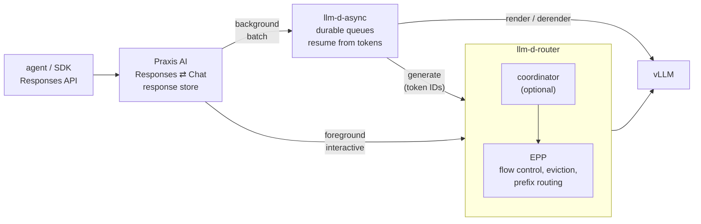
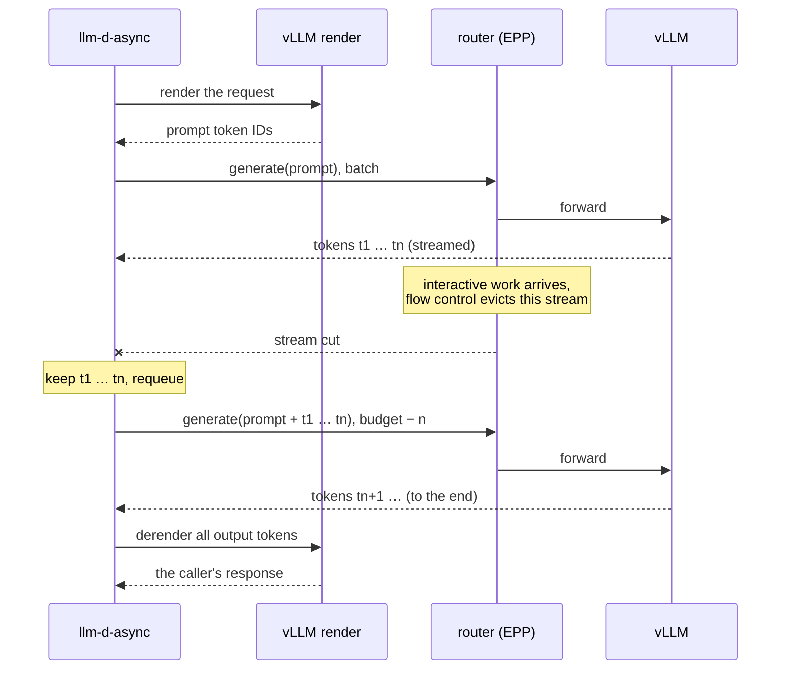
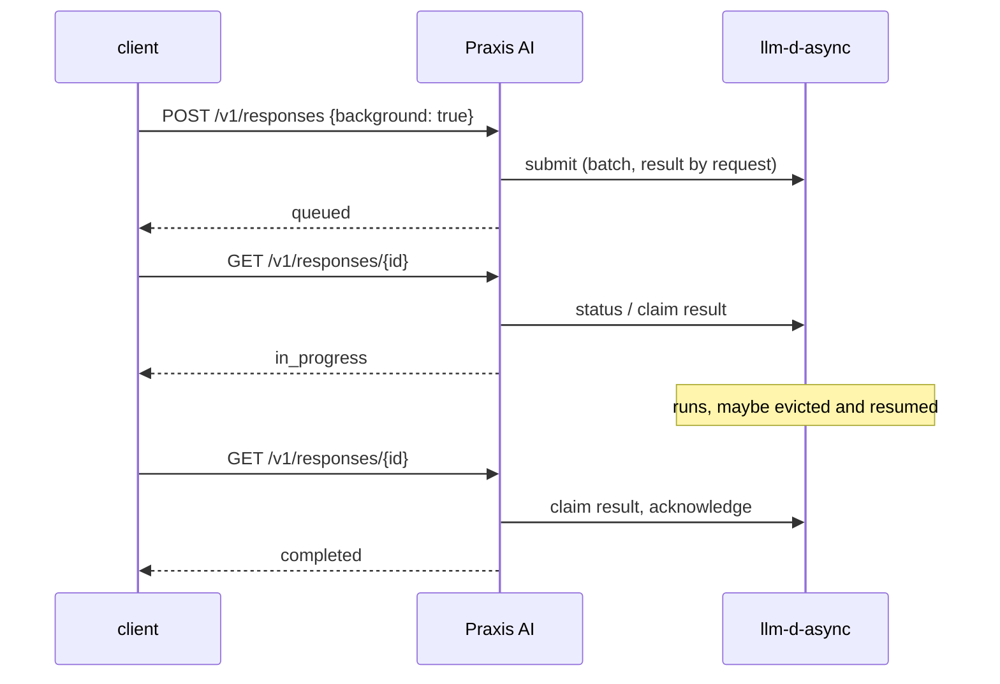

# Agents on llm-d: background work that survives eviction

Can unmodified agents and SDKs (Codex, the OpenAI SDK, eval harnesses) run on
llm-d as prioritized background work that the router may evict at any time,
without losing a token? This experiment says yes, and shows which project each
piece belongs in.

> [!IMPORTANT]
> The Rust processor used here is experimental. It is a place to prove designs
> (resume from saved tokens, results by request, the Postgres store) before
> they go to [llm-d-async](https://github.com/llm-d/llm-d-async).
> What proves out is meant to be upstreamed and, where the project decides it
> belongs, refactored back into the Go processor. It is not a supported
> replacement for it.



Foreground calls are `interactive`: flow control queues them by priority and
never evicts them, so they go straight to the router. Background responses are
`batch` work that flow control may evict at any time, so they go through
llm-d-async.

The loop that makes eviction safe: llm-d-async renders the request to token
IDs, streams `/inference/v1/generate` through the router, and derenders the
output. When flow control evicts a `batch` generation to make room for
`interactive` work, the processor keeps the tokens it received and continues
from prompt plus saved tokens once there is room again. The caller sees one
uninterrupted response.



Background responses follow the OpenAI background contract; Praxis keeps the
response record and llm-d-async runs the work:



## Status (2026-09-26)

| Goal | Result |
|---|---|
| Unmodified agents and SDKs run as prioritized llm-d traffic | works, OpenAI SDK and Codex CLI |
| Responses `background: true` (submit, poll, cancel) | works through Praxis AI |
| Eviction and resume invisible to the caller | token-identical locally; on the GPU cluster an evicted generation resumed through the llm-d coordinator |

On the cluster (GLM-4.7-Flash on an H200, llm-d-router v0.10.0):

- **Codex** fixed a bug and ran its tests through the whole stack: six tool
  calls in 6.5 s, with 88% of prompt tokens served from vLLM's prefix cache.
  (Those runs sent foreground calls through a since-removed OpenAI route on
  the processor; they now go straight to the router.)
- **Through the coordinator**, a resumable queue needs no changes. The
  coordinator passes `/inference/v1/generate` through its decode step and
  forwards the objective header. With 16 `batch` generations of 6,000 tokens
  filling the pool, a burst of 8 `interactive` requests made the EPP evict one
  of them mid-stream. The processor resumed it with 1,016 saved tokens, back
  through the coordinator, and all 16 finished at exactly 6,000 tokens.

## Where each piece belongs

| Piece | Built here | Upstream home | Next step |
|---|---|---|---|
| Results by request | `result_delivery: request`, `GET /v1/requests/{id}` | llm-d-router coordinator `async-broker` enqueue and fetch ([#2325](https://github.com/llm-d/llm-d-router/pull/2325), merged) with [llm-d-async#394](https://github.com/llm-d/llm-d-async/pull/394) | the same model as the broker's per-request results; Praxis background can move onto the broker with the Go processor |
| Resume inside one request | the render → generate → derender loop | coordinator request migration ([llm-d-router#2345](https://github.com/llm-d/llm-d-router/issues/2345), proposal), which lists evict-then-resume as a goal | bring this experiment's evidence to #2345 |
| Resume across requeues | progress saved with the queued request | llm-d-async (Go) | a partial-generation result the processor persists, and a continuation it sends on redispatch |
| Eviction policy | used as is | flow control ([llm-d-router#2061](https://github.com/llm-d/llm-d-router/pull/2061), design) | none; resume is what makes evicting `batch` work cheap |
| Background Responses | Praxis patch 0002 | Praxis background jobs ([praxis-ai#32](https://github.com/praxis-proxy/ai/issues/32), blocked on [praxis#807](https://github.com/praxis-proxy/praxis/issues/807)) | a data point for #32: the lifecycle works with an external durable queue as the runtime |
| Agent compatibility | Praxis patch 0002: streaming reasoning, `summary: omit`, `truncation_auto: disabled` | [praxis-ai#31](https://github.com/praxis-proxy/ai/issues/31), [#951](https://github.com/praxis-proxy/ai/issues/951) | discuss with #31's assignee; the two options go against today's fail-closed decisions |
| Config watcher fix | Praxis patch 0001 | Praxis core ([praxis#1076](https://github.com/praxis-proxy/praxis/issues/1076), [praxis-ai#1015](https://github.com/praxis-proxy/ai/issues/1015)) | adopt core's watcher |
| Token layer gaps | worked around in the processor | vLLM | report the stop token in derendered text; [vllm#58588](https://github.com/vllm-project/vllm/pull/58588) (`output_mode: text`) would remove the derender call |

Nothing above has been proposed upstream yet; Praxis also requires issue
assignment before a PR. The Praxis patches are on the fork for linking:
[`reload-config-on-content-change`](https://github.com/wseaton/ai/tree/reload-config-on-content-change)
(0001) and
[`llm-d-async-background`](https://github.com/wseaton/ai/tree/llm-d-async-background)
(0001, 0002, and the example's foreground change,
[diff](https://github.com/praxis-proxy/ai/compare/main...wseaton:ai:llm-d-async-background)).

## What was built

### llm-d-async (this repository)

- **One resume path.** A resumable queue sends completions and chat requests
  through vLLM's token layer: `render_url` renders the request to prompt token
  IDs, the gateway streams `/inference/v1/generate`, and `render_url` derenders
  the output into the response the caller asked for. An interrupted generation
  retries from prompt + saved tokens with `max_tokens`/`min_tokens` reduced.
  vLLM's own tool and reasoning parsers run in derender, so any parser works. A
  generation that finished but failed to derender keeps its tokens and only
  derenders on retry. See the main README's *Resumable queues*.
- **Results by request.** A submission with `"result_delivery": "request"`
  gets its own result route `@request-<id>`, claimed, renewed and acknowledged
  like any route. `GET /v1/requests/{id}` reports `queued`, `in_progress` or
  `done`. Result writes wake only the long polls on their route, across
  Postgres replicas too.
- **Usage.** Cached prompt tokens come from the generate stream (vLLM with
  `--enable-prompt-tokens-details`), capped at the caller's prompt after a
  resume.
- **Stop tokens.** A stopped generation's final token (the model's stop token,
  such as GLM's `<|user|>`) is left out of what derender decodes, as the
  non-streamed endpoint leaves it out of the text; usage still counts it.
- **Objective header.** The queue's objective is sent as
  `x-llm-d-inference-objective`; a request's own header replaces it.

### Praxis AI (patches in [`praxis-ai/`](praxis-ai))

Against `praxis-proxy/ai` at `b9d60167` (Praxis core 0.7.0), applied in order
with `git apply`.

1. [`0001`](praxis-ai/0001-reload-config-only-when-its-content-changed.patch):
   **config watcher fix.** The watcher observed the config's directory and
   reloaded every pipeline on any write there, so a SQLite response store next
   to the config reloaded continuously. It now reloads only when the config's
   content changed, and still sees atomic replaces and ConfigMap symlink swaps.
   Includes a regression test that fails without the fix.
2. [`0002`](praxis-ai/0002-run-agent-clients-and-background-responses-through-llm-d-async.patch):
   **background mode, streaming reasoning, and agent compatibility.**
   - `openai_response_store` gains a `background:` section
     (`processor_url`, `queue`, `objective`, `deadline_secs`, `timeout_ms`,
     `allow_private_processor_url`, `reasoning`, `truncation_auto`).
   - `openai_responses_format` and `openai_responses_request` take
     `background: continue` (default `reject`).
   - `POST /v1/responses/{id}/cancel` is served.
   - Background continuations (`previous_response_id`) replay stored history
     like foreground rehydration.
   - `responses_to_chat_completions` streams reasoning (the vLLM dialect) as
     its own output item, with `response.reasoning_text.delta` events ahead of
     the message; it used to reject streaming whenever a reasoning dialect was
     configured, and Codex always streams. The terminal matches the
     non-streaming translation exactly.
   - `reasoning.summary: omit` runs requests that ask for a reasoning summary
     the backend cannot produce, returning reasoning without one.
     `truncation_auto: disabled` runs `truncation: "auto"` untruncated and
     reports `disabled`. Both default to rejecting, as before; agent clients
     commonly send both.
   - Example config `examples/configs/openai/responses/background-llm-d-async.yaml`
     with functional tests, unit tests, and regenerated filter docs.

## Codex

Codex CLI 0.154 against the cluster stack in [`cluster/`](cluster/README.md),
with [`codex/config.toml`](codex/config.toml) (Responses wire API through a
port-forward, hosted web search off):

- "List the files and tell me what calc.py does": Codex listed the directory,
  read the file, and identified the bug, in 4.5 s.
- "Fix calc.py so test_calc.py passes, then run the test": six tool calls
  (read, rewrite, re-read, run `python3 test_calc.py` → `ok`) and a correct
  summary, in 6.5 s.
- vLLM counted 90,470 prompt tokens over these runs, of which 79,968 (88%)
  were prefix-cache hits: Codex resends its whole ~9k-token history each turn,
  and every attempt reaches vLLM as token IDs that precise prefix routing
  matches.

What Codex sends, and what it took:

| Codex sends | Handled by |
|---|---|
| `stream: true` on every call | streaming reasoning in `responses_to_chat_completions` (patch 0002) |
| `reasoning.summary: "auto"` | `reasoning.summary: omit` |
| a `namespace` tool (`multi_agent_v1`) | `openai_client_tool_compat` in the IRR step |
| the hosted `web_search` tool | `web_search = "disabled"` in Codex's config |
| `store: false`, full history each turn, `developer` messages, `prompt_cache_key`, `parallel_tool_calls` | translated as is |
| a model ending turns with `<|user|>` | the processor drops the stop token before derender (background calls) |

In-cluster service addresses are private, so Praxis needs
`insecure_options.allow_private_upstreams: true` there.

## Configuration

llm-d-async queue (`transport.json`):

```json
{"queues": [{
  "queue_name": "agents", "igw_base_url": "http://gateway:8000",
  "inference_objective": "batch",
  "render_url": "http://vllm-render:8000"
}]}
```

`render_url`, which makes the queue resumable, is any vLLM serving the
queue's model with `--enable-scale-out`
(render and derender use no GPU). Run vLLM with
`--enable-prompt-tokens-details` to report cached tokens. `igw_base_url` may be
the EPP's gateway or a gateway fronted by the llm-d coordinator.

Praxis AI: see `examples/configs/openai/responses/background-llm-d-async.yaml`
from patch 0002; `tests/e2e/praxis.rs` generates the same configuration with
test ports. The points that matter:

- Foreground: `responses_to_chat_completions` → `path_rewrite` to
  `/v1/chat/completions` → a `headers` filter **inside the IRR step** setting
  `x-llm-d-inference-objective: interactive` (headers set before the IRR do not
  reach its sub-requests) → the inference gateway.
- Background: the response store's `background` section names the
  processor, queue, objective and deadline.
- Timeouts must allow for long generations and time queued in flow control:
  IRR `timeout_ms`, `openai_stream_events.timeout_secs`, and
  `responses_to_chat_completions.stream_timeout_secs: 0`.
- Keep the response store's database outside the config file's directory on
  Praxis builds without patch 0001.

## Evidence

Everything below runs locally with no GPU: the vLLM 0.30 frontend over
`vllm-vcr`, which replays scripted output tokens
(`tests/fixtures/vllm/v0.30.0/resume/trace.jsonl`), behind a gateway that
cuts, stalls or sheds generate streams the way flow control evicts them.

- **Fixtures** (`tests/fixtures/vllm`, recorded from Python vLLM 0.30): for
  every case, the render → generate → derender response equals vLLM's native
  non-streamed response, except per-run IDs and timestamps, `system_fingerprint`,
  `stop_reason`, reasoning-token counts and per-request metrics. Every cut
  point of every case resumes into the identical token sequence.
- **`tests/e2e/resumable.rs`**, the processor against real vLLM:
  - fresh chat, completion and tool-call requests match vLLM's own responses;
  - evicted mid-stream, the same requests resume into identical responses;
  - a shed continuation is sent again;
  - a failed derender re-derenders without regenerating;
  - a render error surfaces as vLLM's 400;
  - ineligible requests pass through as submitted;
  - a draining replica hands its progress to the next.
- **`tests/e2e/praxis.rs`**, the OpenAI SDK's Responses API through Praxis AI:
  - foreground straight to the gateway as `interactive`;
  - streamed foreground with reasoning events ahead of the message;
  - background `queued → in_progress → completed`, evicted after 24 tokens
    on the way (the continuation carries 20 prompt + 24 saved tokens), with
    the same answer and reasoning;
  - idempotent cancel;
  - function calls in both modes;
  - a background turn continuing a background tool call, then a foreground
    turn continuing that;
  - agent-style `reasoning.summary: "auto"` and `truncation: "auto"`;
  - background + stream refused.
- **Prefix reuse across agent turns**: turn 2's rendered prompt shares 195 of
  turn 1's 207 prompt-plus-output tokens (about 90% of turn 2's prompt). The
  prior reasoning replays intact; the difference is the chat template
  re-serializing the tool call, as native chat serving does too.

On the GPU cluster: the Codex runs and the coordinator eviction run above;
[`cluster/`](cluster/README.md) deploys both.

Earlier cluster runs (llm-d-router v0.10.0, vLLM 0.30.0, the text-continuation
path this replaces) showed the value of resuming under flow-control eviction:
token-identical output at 1.5B; interactive TTFT held at the no-load floor
(p95 0.44 s vs 6.5 s) with eviction; restarting instead of resuming dropped
deadline hit rates to 1%; precise prefix routing cut prefill 32% on 4 × 14B.
Details: [`../resume-demo/eviction/README.md`](../resume-demo/eviction/README.md).

## Running it

```sh
S=$(mktemp -d)
# vLLM 0.30 CPU frontend (macOS arm64 wheel; use the matching one elsewhere)
uv venv --python 3.12 $S/vllm-venv
VIRTUAL_ENV=$S/vllm-venv uv pip install \
  'https://github.com/vllm-project/vllm/releases/download/v0.30.0/vllm-0.30.0+cpu-cp312-cp312-macosx_11_0_arm64.whl'
# vllm-vcr for the 0.30 engine protocol: in a vllm-vcr checkout, add a compat.toml
# line (tag v0.30.0, protocol_rev ced6857afa0ea7b2e3f0846a62e1394e90f15607,
# default = true), point vllm-engine-core-client at that rev, then
cargo build --release --bin vllm-vcr
# Praxis AI with both patches
git -C praxis-ai apply 0001-*.patch 0002-*.patch
cargo build -p praxis-ai-proxy --features full,store-sqlite   # in praxis-ai

VLLM_BIN=$S/vllm-venv/bin/vllm VCR_BIN=<vllm-vcr> REQUIRE_VLLM=1 \
PRAXIS_AI_BIN=<praxis-ai>/target/debug/praxis-ai REQUIRE_PRAXIS=1 \
TEST_DATABASE_URL=postgres://… REQUIRE_POSTGRES=1 \
cargo test --test e2e
```

The frontend loads `zai-org/GLM-4.7`'s tokenizer from the Hugging Face cache
offline; fetch it once. The SDK clients run through `uv`.

## Known limits

- **Derender does not report** reasoning-token counts (Praxis reports `0`),
  `stop_reason`, or `system_fingerprint`. Stop strings, stop token IDs, prompt
  truncation, logprobs, seeds, structured output, forced tool choice,
  penalties, `n > 1` and caller streams on the processor's queue API are sent as
  submitted and restart on eviction.
- **Background mode** runs without streaming, `conversation`, or server-side
  tools (those need Praxis's agentic loop to run detached from the client).
  Cancel is pre-dispatch at the processor; an in-flight generation finishes
  and its result is discarded. DELETE does not cancel at the processor.
- `in_progress` means claimed by a processor, including its dispatch buffer.
- The processor renders on its own `render_url`, not through the coordinator's
  render step. Through the coordinator it was tested on an aggregated pool
  only; how the coordinator's prefill/decode phasing treats the processor's
  generate calls is untested.
- Praxis's llm-d `ext_proc` mode (`integrations/llmd/ext-proc`) cannot carry
  EPP eviction yet: the EPP evicts with an unsolicited `ImmediateResponse`
  during the response (llm-d-router v0.10.0 `pkg/epp/handlers/server.go:392`),
  but the filter only reads the stream in the request phase and supports
  `response_body_mode: none`. The inner gateway stays Envoy-based until it
  does.
- The Go and Python clients do not expose `result_delivery` or request status.

## Next

1. Take the resume evidence to
   [llm-d-router#2345](https://github.com/llm-d/llm-d-router/issues/2345) and
   propose the partial-generation contract between the coordinator and
   llm-d-async.
2. Codex under load: concurrent Codex sessions as `interactive` with a
   `batch` background load evicted around them, measuring resumes, tail
   latency and prefix hits.
3. Praxis: agree on background mode and agent compatibility on #32 and #31
   before opening PRs; report the derender stop token to vLLM.
